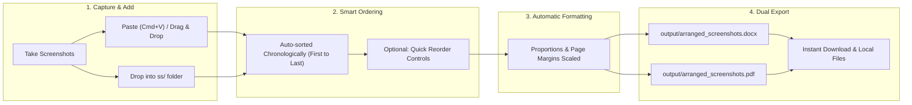

# SnapStitch

> **Navigation**: [**Overview (README.md)**](README.md) &nbsp;•&nbsp; [**User Guide & Setup (USAGE.md)**](USAGE.md)

A tool to sequence, arrange, and compile bulk screenshots into clean Microsoft Word (`.docx`) and PDF (`.pdf`) documents.

---

## Why SnapStitch?

When working on lab records, assignments, code walkthroughs, or project documentation, you often capture dozens of screenshots. Putting them into a final document by hand is slow and repetitive:
- Inserting images one by one into a word processor takes time.
- Images need manual resizing so they do not break page margins or look distorted.
- Keeping screenshots in the exact order you took them requires constant checking.
- Producing both an editable Word file and a final PDF requires repeating export steps.

SnapStitch handles all of this automatically.

---

## Automatic Chronological Ordering

SnapStitch automatically sequences your screenshots so your documentation follows your exact workflow:

1. **True Creation Time Sequencing**:
   - SnapStitch automatically reads each file's creation timestamp and arranges all images in chronological order—from the earliest screenshot you captured to the very last one.

2. **Works Regardless of File Names**:
   - No matter what your files are named (default OS screenshot names, camera filenames, or random strings), you never need to rename them. SnapStitch sequences them based on when they were actually taken.

3. **Full Manual Control When Needed**:
   - Fine-tune your document at any time using simple Move Up, Move Down, and Reverse controls in the web interface.

---

## Core Capabilities

- **Instant Ingestion**: Drag and drop batches of images, paste directly from your clipboard (`Cmd+V` / `Ctrl+V`), or place files inside the local `ss/` folder.
- **Automatic Proportion Scaling**: Every screenshot is automatically scaled to fit standard page dimensions (Letter or A4) with balanced margins, preventing image distortion or page overflow.
- **Dual Format Output**: Compiles both Microsoft Word (`.docx`) and PDF (`.pdf`) files in a single pass.
- **Clean Documents (No Watermarks)**: Output files are completely clean and unbranded, suitable for academic and professional submissions.
- **Numbered Captions**: Optional automatic captions display the sequential number and file name above each image.
- **Workspace Reset**: Clear your workspace with one click after downloading so old screenshots never mix into your next project.

---

## Workflow Overview



---

## Project Structure

```text
├── index.html           # SnapStitch web application interface
├── server.py            # Local HTTP server and generation API
├── main.py              # Compilation engine and CLI entry point
├── TEST.PY              # Backward-compatible execution script
├── requirements.txt     # Python dependencies
├── pyrightconfig.json   # Configuration for type analysis
├── .gitignore           # Git ignore rules
├── logo.png             # SnapStitch header logo
├── favicon.png          # Browser favicon asset
├── favicon.ico          # Multi-resolution icon file
├── USAGE.md             # Complete step-by-step setup and operational guide
├── ss/                  # Local folder for input screenshots
└── output/              # Local folder for generated DOCX and PDF documents
```

---

## Getting Started & Setup

For complete step-by-step setup instructions, cloning the repository, running the web service, command-line operations, and resetting your workspace, please refer to the [**USAGE.md**](USAGE.md) guide.

---

## Technical Specifications

| Component | Implementation |
| :--- | :--- |
| Backend Server | Python standard library (`http.server`) |
| DOCX Engine | `python-docx` |
| PDF Engine | `reportlab` |
| Image Processing | `Pillow` (PIL) |
| Web Interface | Vanilla JavaScript, HTML5, CSS3 (Zero external web framework dependencies) |
| Supported Formats | PNG, JPG, JPEG, WEBP, BMP, TIFF, GIF |

---

## Author

**Prathamesh More**