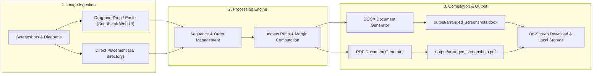

# SnapStitch

A minimalist tool to sequence and compile screenshots and image assets into clean Microsoft Word (`.docx`) and PDF (`.pdf`) documents.

**Built by Prathamesh More**

---

## The Problem

When preparing lab submissions, assignments, project documentation, or technical reports, you often capture dozens of screenshots or download reference diagrams that need to be organized in a specific order.

Doing this manually is frustrating and tedious:
- You have to insert images one by one into a document editor.
- You waste time resizing each screenshot so it does not overflow margins or get distorted.
- Keeping images in their correct sequential order requires constant readjustment.
- You have to repeat export steps to produce both editable Word files and submission-ready PDFs.

---

## The Solution

SnapStitch automates the entire process:
- **Instant Ingestion**: Drag and drop any number of screenshots into the web interface, paste them from the clipboard (`Cmd+V` / `Ctrl+V`), or place them directly into the `ss/` folder.
- **Automatic Sequence**: Images are arranged chronologically or in your custom defined order.
- **Smart Formatting**: Image dimensions and aspect ratios are calculated automatically to fit page bounds without manual resizing.
- **Dual Export**: Compiles both `.docx` and `.pdf` files simultaneously, saving them to the `output/` directory and providing instant on-screen download buttons.

---

## Workflow Architecture



---

## Key Features

- **Automated Chronological Sequencing**: Automatically orders images based on creation or modification timestamps, with manual reordering capabilities in the web interface.
- **Dynamic Dimension Scaling**: Automatically computes proportions to ensure all images fit cleanly within standard page boundaries (Letter / A4) without cropping or distortion.
- **Dual Format Compilation**: Compiles both Microsoft Word (`.docx`) and PDF (`.pdf`) formats in a single pass.
- **Clean Output**: Generated documents are clean and unwatermarked for official academic and professional submissions.
- **Flexible Execution**: Operates via a minimalist web interface or direct command-line interface (CLI).
- **Automated Directory Persistence**: Images submitted through the web interface are automatically persisted in the `ss/` directory, while compiled documents are written directly to `output/`.

---

## Project Structure

```text
├── index.html           # SnapStitch minimalist web application
├── server.py            # Local HTTP service and API handler
├── main.py              # Core compilation engine and CLI entry point
├── TEST.PY              # Backward-compatible execution wrapper
├── requirements.txt     # Project dependencies
├── pyrightconfig.json   # Static analysis configuration
├── .gitignore           # Git ignore definitions
├── logo.png             # SnapStitch brand logo
├── favicon.png          # Favicon icon
├── USAGE.md             # Detailed operational user guide
├── ss/                  # Input directory for raw screenshot files
└── output/              # Target directory for generated DOCX and PDF files
```

---

## Installation

### Prerequisites
- Python 3.8 or higher
- `pip` package manager

### Setup Instructions

1. Clone the repository:
   ```bash
   git clone https://github.com/prathameshmore07/SnapStitch.git
   cd SnapStitch
   ```

2. Create and activate a virtual environment:
   ```bash
   # macOS / Linux
   python3 -m venv venv
   source venv/bin/activate

   # Windows
   python -m venv venv
   venv\Scripts\activate
   ```

3. Install required dependencies:
   ```bash
   pip install -r requirements.txt
   ```

---

## Usage Guide

### Method 1: Web Application Interface (Recommended)

1. Launch SnapStitch:
   ```bash
   python3 main.py
   ```
2. The default browser will open to `http://localhost:5050`.
3. Add screenshots by dragging and dropping files, using the file selector, or pasting from clipboard (`Cmd+V` / `Ctrl+V`).
4. Reorder or remove items as necessary using the queue controls.
5. Click **Compile & Save Documents**.
6. Download the resulting PDF or DOCX files directly from the screen, or retrieve them from the `output/` directory.

### Method 2: Command-Line Interface (CLI)

1. Place your screenshot files directly into the `ss/` folder.
2. Execute the compilation script:
   ```bash
   python3 main.py --cli
   ```
3. Retrieve compiled documents from the `output/` folder:
   - `output/arranged_screenshots.docx`
   - `output/arranged_screenshots.pdf`

---

## Technical Specifications

| Component | Implementation |
| :--- | :--- |
| Backend Server | Python standard library (`http.server`) |
| DOCX Engine | `python-docx` |
| PDF Engine | `reportlab` |
| Image Processing | `Pillow` (PIL) |
| Frontend | Vanilla JavaScript, HTML5, CSS3 (No external framework dependencies) |
| Supported Image Formats | PNG, JPEG, JPG, WEBP, BMP, TIFF, GIF |

---

## Author

**Prathamesh More**
- GitHub: [github.com/prathameshmore07](https://github.com/prathameshmore07)
- Repository: [github.com/prathameshmore07/SnapStitch](https://github.com/prathameshmore07/SnapStitch)