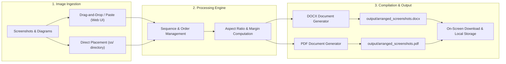

# Screenshot Arranger and Document Compiler

A high-efficiency tool for aggregating, sequencing, and compiling bulk screenshots and image assets into professionally formatted Microsoft Word (`.docx`) and PDF (`.pdf`) documents.

---

## Problem Statement

When preparing academic lab submissions, technical reports, bug documentation, or project portfolios, users frequently capture dozens of screenshots across terminals, simulators, and browser sessions.

The manual compilation workflow presents several friction points:
- **Repetitive Formatting**: Individually inserting dozens of screenshots into a word processor is tedious and time-consuming.
- **Inconsistent Layouts**: Manual scaling often results in distorted aspect ratios, awkward page overflows, or misaligned margins.
- **Ordering Difficulties**: Keeping screenshots in the exact execution sequence requires constant manual reorganization.
- **Redundant Exporting**: Generating both editable Word documents and shareable PDFs requires separate export workflows.

This tool solves these pain points by providing an automated pipeline that accepts screenshots via an interactive drag-and-drop interface or local directory, preserves native aspect ratios, sequences items in chronological or custom order, and outputs both formatted DOCX and PDF documents simultaneously.

---

## Workflow Architecture



---

## Key Features

- **Automated Chronological Sequencing**: Automatically orders images based on creation or modification timestamps, with manual reordering capabilities in the web interface.
- **Dynamic Dimension Scaling**: Automatically computes proportions to ensure all images fit cleanly within standard page boundaries (Letter / A4) without cropping or distortion.
- **Dual Format Compilation**: Compiles both Microsoft Word (`.docx`) and PDF (`.pdf`) formats in a single pass.
- **Flexible Execution**: Operates via a minimalist web interface or direct command-line interface (CLI).
- **Automated Directory Persistence**: Images submitted through the web interface are automatically persisted in the `ss/` directory, while compiled documents are written directly to `output/`.

---

## Project Structure

```text
├── index.html           # Minimalist web application interface
├── server.py            # Local HTTP service and API handler
├── main.py              # Core compilation engine and CLI entry point
├── TEST.PY              # Backward-compatible execution wrapper
├── requirements.txt     # Project dependencies
├── pyrightconfig.json   # Static analysis configuration
├── .gitignore           # Git ignore definitions
├── ss/                  # Input directory for raw screenshot files
└── output/              # Target directory for generated DOCX and PDF files
```

---

## Installation

### Prerequisites
- Python 3.8 or higher
- `pip` package manager

### Setup Instructions

1. Clone the repository:
   ```bash
   git clone <repository-url>
   cd <repository-directory>
   ```

2. Create and activate a virtual environment:
   ```bash
   # macOS / Linux
   python3 -m venv venv
   source venv/bin/activate

   # Windows
   python -m venv venv
   venv\Scripts\activate
   ```

3. Install required dependencies:
   ```bash
   pip install -r requirements.txt
   ```

---

## Usage Guide

### Method 1: Web Application Interface (Recommended)

1. Launch the application:
   ```bash
   python3 main.py
   ```
2. The default browser will open to `http://localhost:5050`.
3. Add screenshots by dragging and dropping files, using the file selector, or pasting from clipboard (`Cmd+V` / `Ctrl+V`).
4. Reorder or remove items as necessary using the queue controls.
5. Click **Compile & Save Documents**.
6. Download the resulting PDF or DOCX files directly from the screen, or retrieve them from the `output/` directory.

### Method 2: Command-Line Interface (CLI)

1. Place your screenshot files directly into the `ss/` folder.
2. Execute the compilation script:
   ```bash
   python3 main.py --cli
   ```
3. Retrieve compiled documents from the `output/` folder:
   - `output/arranged_screenshots.docx`
   - `output/arranged_screenshots.pdf`

---

## Technical Specifications

| Component | Implementation |
| :--- | :--- |
| Backend Server | Python standard library (`http.server`) |
| DOCX Engine | `python-docx` |
| PDF Engine | `reportlab` |
| Image Processing | `Pillow` (PIL) |
| Frontend | Vanilla JavaScript, HTML5, CSS3 (No external framework dependencies) |
| Supported Image Formats | PNG, JPEG, JPG, WEBP, BMP, TIFF, GIF |
